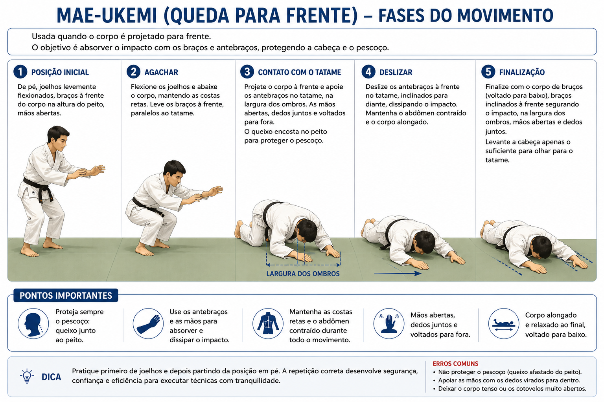
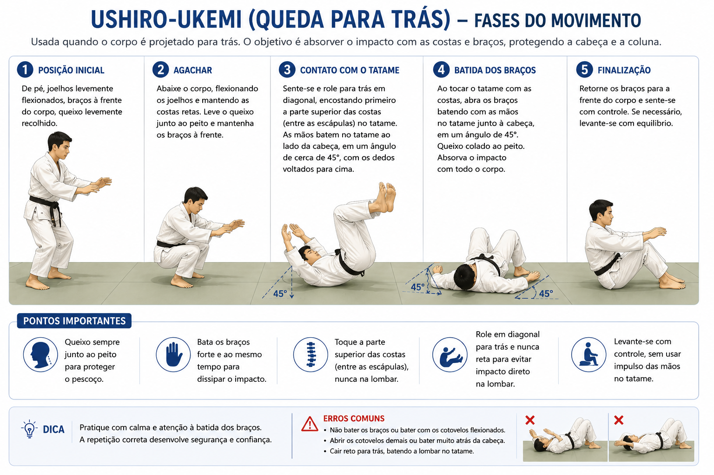
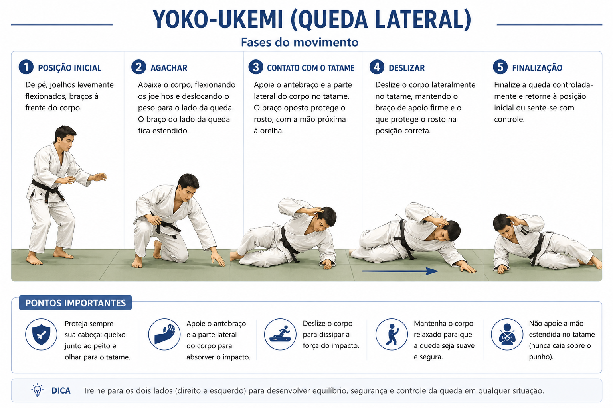
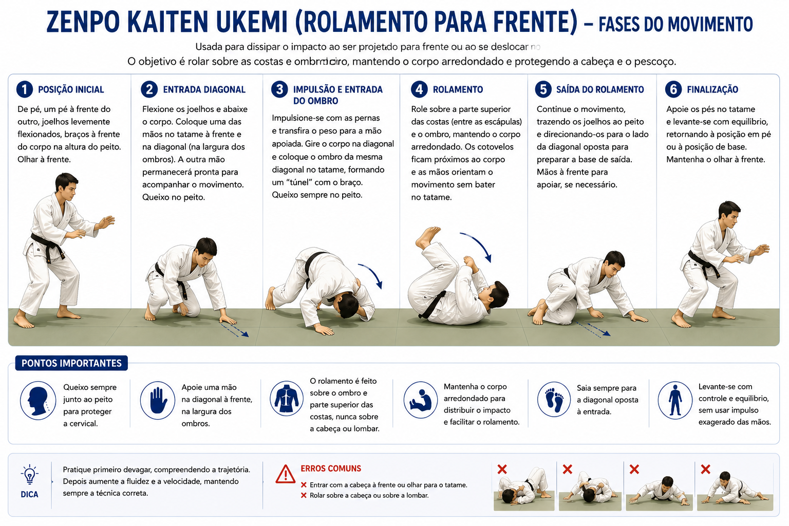

---

## 🎯 Objetivo

Os **educativos de queda (ukemi)** têm como finalidade:

* **Prevenir lesões**
* **Ensinar o corpo a dissipar o impacto**
* **Aumentar a confiança durante a prática**
* **Permitir execução segura das técnicas**

---

## 📌 Tipos principais de ukemi

### 🔹 Mae-ukemi (queda para frente)

* Usada quando o corpo é projetado para frente
* Absorção com braços e antebraços
* Rosto protegido (sem contato com o solo)

<iframe width="560" height="315" src="https://www.youtube.com/embed/veM5RFdjo0U?si=yL__dBk_rZACR3Ng" title="YouTube video player" frameborder="0" allow="accelerometer; autoplay; clipboard-write; encrypted-media; gyroscope; picture-in-picture; web-share" referrerpolicy="strict-origin-when-cross-origin" allowfullscreen></iframe>

---

### 🔹 Ushiro-ukemi (queda para trás)

* Queda de costas com **batida de braço no tatame**
* Queixo no peito (proteção cervical)
* Distribuição do impacto

<iframe width="560" height="315" src="https://www.youtube.com/embed/_g7rvsxTkz8?si=VAoU9ijBMOnIVu7X" title="YouTube video player" frameborder="0" allow="accelerometer; autoplay; clipboard-write; encrypted-media; gyroscope; picture-in-picture; web-share" referrerpolicy="strict-origin-when-cross-origin" allowfullscreen></iframe>

---

### 🔹 Yoko-ukemi (queda lateral)

* Queda para o lado
* Um braço amortece o impacto
* Corpo levemente curvado

<iframe width="560" height="315" src="https://www.youtube.com/embed/JCwK1Ia4jsc?si=kZ-Mmcigabxx2KmZ" title="YouTube video player" frameborder="0" allow="accelerometer; autoplay; clipboard-write; encrypted-media; gyroscope; picture-in-picture; web-share" referrerpolicy="strict-origin-when-cross-origin" allowfullscreen></iframe>

---

### 🔹 Zenpo kaiten ukemi (rolamento)

* Movimento de rolamento
* Dissipa o impacto ao longo do corpo
* Muito usado em projeções dinâmicas

<iframe width="560" height="315" src="https://www.youtube.com/embed/SvF0g7rhQII?si=s_VgWKaTAnY4zRjc" title="YouTube video player" frameborder="0" allow="accelerometer; autoplay; clipboard-write; encrypted-media; gyroscope; picture-in-picture; web-share" referrerpolicy="strict-origin-when-cross-origin" allowfullscreen></iframe>

---

## ⚙️ Princípios fundamentais

* **Relaxamento do corpo** (evitar rigidez)
* **Distribuição do impacto** (não concentrar em uma área)
* **Proteção da cabeça e pescoço**
* **Sincronização do movimento com a queda**

---

## ⚠️ Erros comuns

* Cair com o braço esticado (risco de lesão)
* Não proteger a cabeça
* Rigidez corporal
* Falta de controle na respiração

---

## 🧠 Progressão pedagógica

1. Quedas sentadas
2. Quedas agachadas
3. Quedas em pé
4. Quedas com deslocamento
5. Quedas com projeção (parceiro)

---

## 🏋️ Aplicação na aula

* Aquecimento inicial
* Parte técnica (antes das projeções)
* Exercícios repetitivos (automatização)

---

## 💡 Dica didática

> O domínio do ukemi é a base do judô: antes de aprender a projetar, é essencial aprender a cair.

---

# ✅ Resumo final

Os **educativos de queda** são fundamentais no judô, pois:

* Garantem segurança
* Desenvolvem consciência corporal
* Sustentam a evolução técnica

